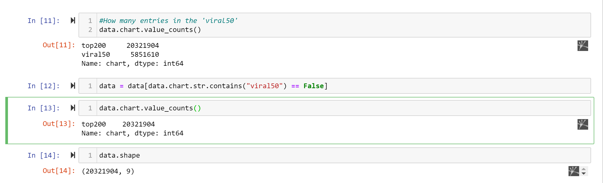

1. Look at the big picture.

* Kaggle dataset
* Spotify Api
* Genius Lyrics Api

In this usecase we chose the Spotify Kaggle dataset. This data has metrics such as:

**Title**: Spotify Dataset 1921-2020, 600k+ Tracks\
**Subtitle**: Audio features of 600k+ tracks, popularity metrics of 1M+ artists\
**Source**: Spotify Web API\
**Creator**: Yamac Eren Ay\
**Release Date** (of Last Version): April 2021****

**The problem**
The model’s output will be a prediction of a how many songs, a given artist's, is expected to release in a given year.

**Perfomance measure**

For this model we choose the performance measure Root Mean Square Error (RMSE) for the
regression problems. It gives an idea of how
much error the system typically makes in its predictions, with a higher weight for large errors.

2. Get the data.

Tha data needed for this was spread across multiple tables/documents/files. To
access the data, we need to get your credentials and access authorizations.

For this particular use-case, the features was already collected and handle.
If this use-case was to be further developed, we would need to get your credentials for the Spotify Api, which would allow us to make regressions on current artists.

This is how the data was collected.

    import pandas as pd
    data = pd.read_csv("charts/charts.csv")

The data was then lightly explored using .head() .describe() .value_count()

Here we notice that the data contain top200 og 50 viral. Viral is removed to imporove perfomance

After the data is split into train set with distribution of 80%/20%.

    def split_train_test(data, test_ratio):
    shuffled_indices = np.random.permutation(len(data))
    test_set_size = int(len(data) * test_ratio)
    test_indices = shuffled_indices[:test_set_size]
    train_indices = shuffled_indices[test_set_size:]
    return data.iloc[train_indices], data.iloc[test_indices]
    
    train_set, test_set = split_train_test(data, 0.2)

3. Discover and visualize the data to gain insights.
4. Prepare the data for Machine Learning algorithms.
5. Select a model and train it.
6. Fine-tune your model.
7. Present your solution.
8. Launch, monitor, and maintain your system.
