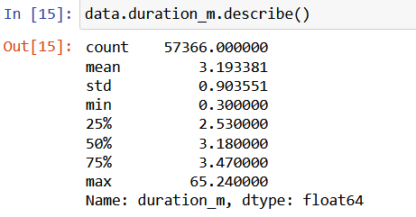
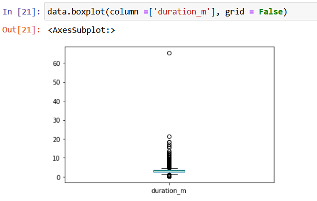
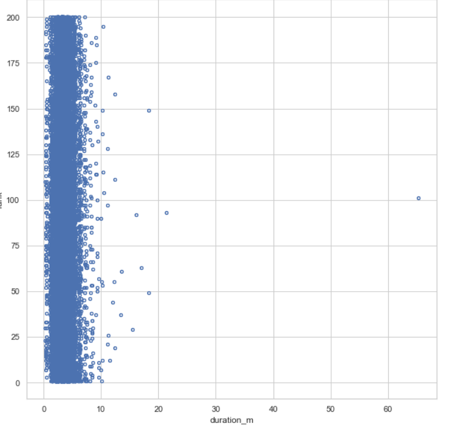
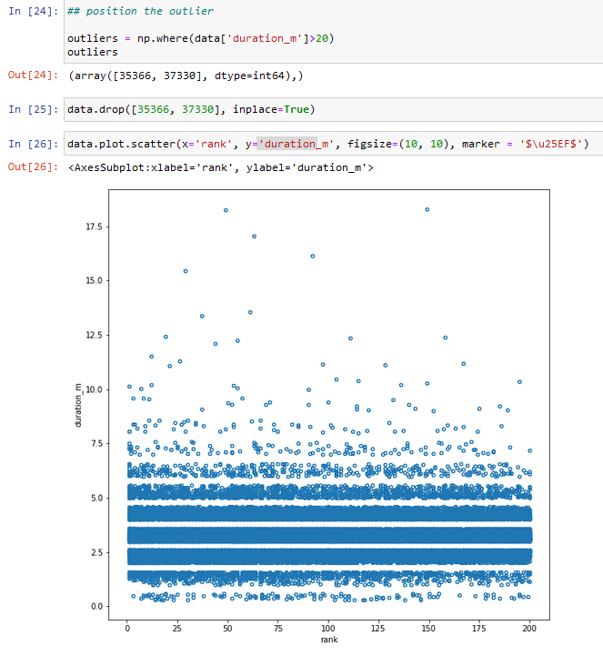

# Stage 2 - Data

Objective: Data acquisition and exploration

Based on the ideas and assumptions defined at the previous stage of your business case analysis, create the first prototype of your solution implementation.

    1 Searching Internet and other media, find relevant data sources that can be used in your experiments.
    2 Collect and integrate the data sources in shared repository by either ETL (Extract Transform Load) or ELT (Extract Load Transform).
    3 Explore the data by applying methods of descriptive and inferential statistics.
    4 Design data processing scenario
    5 Decide on data processing parameters
    6 Apply data visualisation techniques
    7 Prepare a dashboard as a collection of diagrams and brief explanation that can serve the selected business

4. Prepare the data for machine learning analysis, ensuring that the data is:

   1 meaningful – describes relevant and correctly measured features and observations\
   2 sufficient – describes various cases and feature occurrences, decided by testing\
   3 shaped – presented in a structure, appropriate for processing by machine learning algorithms\
   4 cleaned – repaired from missing values and outliners\
   5 scaled – transform data distributions in comparable scales, when necessary\
   6 engineered – analyse all features and select the most informative for further processing

***

## Based on the ideas and assumptions defined at the previous stage of your business case analysis, create the first prototype of your solution implementation.

### 1
We are using a Kaggle dataset contain top 200 spotify top 200 songs from 2017 to 2021. This set consists of more than 20 million songs.
https://www.kaggle.com/datasets/dhruvildave/spotify-charts

**This dataset is too big to include in a github repository, therefore it must be downloaded seperatly and placed in DataScience-SongManagement/data to be able to run some stages in our project** 

https://github.com/HolmQ84/DataScience-ExamProject/tree/main/DataScience-SongManagement
This is the folder where our process is happening

### 2

By using the Kaggle dataset, we are using the information found in the dataset to extract data from the spotify API to get the features related
to each song in our set.

After getting the features, we use an API from https://genius.com/ to collect the lyrics from each song in the dataset and store it in a mongoDB.

Going through our dataset yet again, we create a web scraper to extract the collaborators on each song, so we can get a sense of who
has contributed to the song, either by producing, writing, featuring or released the song.

### 3
We are exploring the data in our jupyter file Data Exploration, where we try to get some descriptive insights in what the columns mean
and what information each of these is containing to better understand how to further operate on the data we have collected.

### 4
We are processing the data in the python files:
https://github.com/HolmQ84/DataScience-ExamProject/tree/main/DataScience-SongManagement/2%20-%20Process%20Data

### 5
The parameters we remove to make our dataset more manageable are:

- Null values in crucial columns. - such as title or artists.
- Removing a column named "trends". - This column shows if a song has moved up or down on the chart.
- Remove outliers in duration.
- Remove duplicates where title AND artist are the same.
- Remove all rows with the "viral50" column, as this is not correlated to our case of finding the top hit songs, and then remove the column afterwards.

### 6
The data visualization techniques can also be seen in:
https://github.com/HolmQ84/DataScience-ExamProject/tree/main/DataScience-SongManagement/2%20-%20Process%20Data

### 7 
This can be seen in: https://github.com/HolmQ84/DataScience-ExamProject/tree/main/DataScience-SongManagement/3%20-%20Explore%20data

## Prepare the data for machine learning analysis

 
We have cleaned the dataset to make sure that the data is meaningful and useful to further operate on.
This is done by: 
    Exploring the data and ensure no null values exists in our dataset.
    Remove duplicates in the dataset.
    Visualising the correlations between the data, and presenting this in a heatmap.
    Removing columns that do not benefit our data in any way.

We have created ipynb files to process the data preparation for machine learning analysis.
We also do this multiple times, while building our models and are shown in our process of this under the files.

Here we are looking at the data from different angels, by following various data exploration methods to find meaningful ways to 
operate on our data.
We are also changing some column values i.e "druation_ms" which is the duration of a song. 
In the original dataset is presented in milliseconds, but we decide to change this to minutes instead to make it easier to grasp.
this quickly shows us that there are outliers that shows a song's duration to be over 60 minutes long.
When we describe the data, we can clearly see that the average duration of the songs is about 3 minutes long.

 

Now we find the position of the outliers where the duration is more than 20 minutes.

By looking at the data, we are fairly confident that we are going to be able to make some meaningful models.
The columns we are looking mostly at when we are going to start building our models is the following:
- Danceability.
- Energy.
- Loudness.
- Speechiness. 
- Acousticness.
- Instrumentalness.
- Liveness.
- Valence.
- Tempo.
