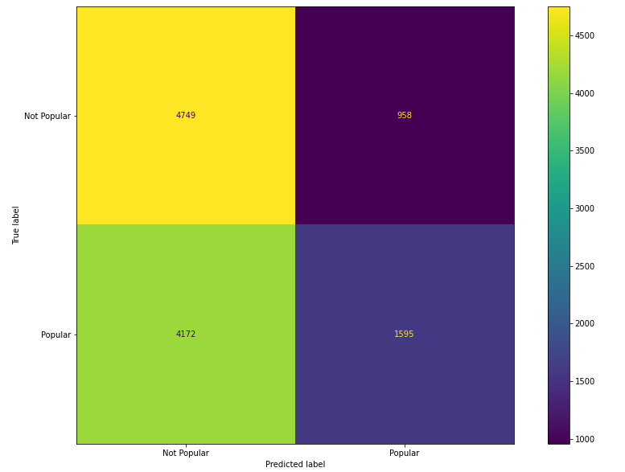
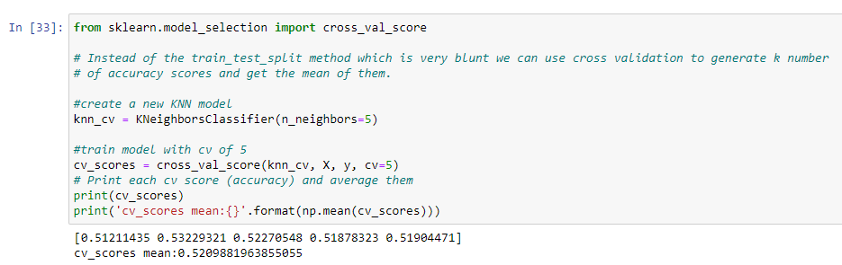
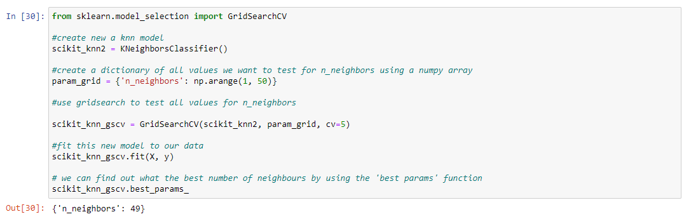
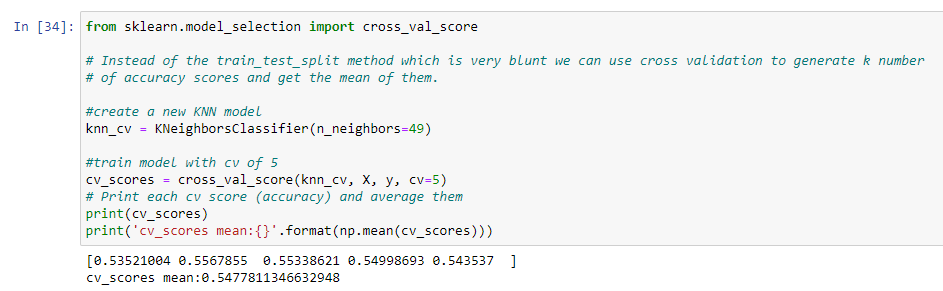

#Stage 3: Artificial Intelligence

###Objective: Using the data and the exploration results for building predictive models

Extend the analysis by implementing machine learning or deep learning methods and algorithms.

1. Select at least two relevant AI methods that could solve the problem.
   a. train models by use of supervised and unsupervised methods, neural networks or graphs
   b. test the models created by the learners on test data sets to predict the output
   c. validate the models with new data sets

2. Select appropriate measures for assessing the quality of your models
   a. calculate appropriate measures to prove the validity of the models

3. Iterate the operations listed above several times, trying to improve the quality of the models, as
   much as possible

4. Compare the results of the validation and select the best performing model. Store the trained
   model in a file for further implementation.

5. Integrate the predictive model with the other modules in the scenario as appropriate, in a new AI
   prototype of your product.

***

#### Model 1 - Mood prediction

First model is an attempt to predict the mood of a given song, based on the "feature" parameters:
- Acousticness
- Danceability
- Energy
- Instrumentalness
- Liveness
- Loudness
- Speechiness
- Valence
- Tempo

The mood of the song is set in four categories, Energetic, Happy, Calm and Sad, based on the following classifier:

The idea of this comes from an article found on this page https://sites.tufts.edu/eeseniordesignhandbook/2015/music-mood-classification/

in the notebook located here: https://github.com/HolmQ84/DataScience-ExamProject/blob/main/DataScience-SongManagement/JupyterNotebook/Data%20Modelling/Analysing%20songs%20to%20find%20the%20mood.ipynb

We are using a supervised training based on a music dataset, that already contains the moods classified in the small dataset.\
first we normalize the features of the song with MinMaxScaler to scale the values between 0 and 1. This is keep the shape of the original distribution.\
then we encodes the mood labels of the song. We do this because when working with neural networks, we need numerical values \
to train the model.
We are using Keras which is an open source software library that provides a interface for python. While we have little to no experience\
in working with neural networks, we choose this, as it is user-friendly and provides the most commonly used building blocks\
in neural-network.

Our model will consist of 10 features, nine of them are mentioned above, and the 10th feature is the length of the song.
Then we will create one layer with 8 nodes and 4 outputs. We are using Rectified Linear Unit (ReLU) and "adam".\
"Adam" is different to the classic stochastic gradient descent, because it allows the learning weight to be changes under the learning process.\

Through the process, we are using cross_val_score to find the best accuracy in the model, we ended on 78

after trying with different numbers of batches and epocs, we experienced that 300 epocs and 200 in batch size was ideal.\

We also tried the model on our own dataset, and got some pretty good results.\

We have created a folder that contains our saved model, so that they will be ready for further use.

***

#### Model 2 - Popularity prediction

The second model is an attempt to predict the popularity of a given song, based on the "feature" parameters:

- Acousticness
- Danceability
- Energy
- Instrumentalness
- Liveness
- Loudness
- Speechiness
- Valence
- Tempo

The popularity of the song is set in two categories, Popular and Not popular - which is based on the number of streams for each song.

in the notebook located here: https://github.com/HolmQ84/DataScience-ExamProject/blob/main/DataScience-SongManagement/JupyterNotebook/Data%20Modelling/Calculate%20popularity%20based%20on%20streams.ipynb

#### The approach

Our approach is as follows:

- Create a new column called 'Popularity', where we divide the songs into 2 categories: "Popular" and "Not popular". This is based on the mean of the streams, where the 50% above the mean is called Popular, and the 50% below is called "Not Popular".
- Remove the unwanted columns which cannot be used for training the model.
- Divide the dataset into 4 sets:
  - train set: 80% of the data set for machine learning.
  - test set: 20% of the data set for testing the prediction.
- Use the Bayes Classification model GaussianNB to train the model.
- Test the accuracy on the test set.
- Show a confusion matrix to get a overview of how the predictions went.

- Use cross validation score to show the accuracy on the model (With a knn of 5 neighbors.)

- Use k-nearest neighbor to find out the optimal number of neighbors to make the prediction on.

Which shows that the optimal number is 49, with a range of 1-100 (The number of songs make the model very slow with higher numbers.)

- Run the cross validation score again with the optimal amount of neighbors.

Which gives us a more precise model.

Even though 54% is a horrible score for a prediction model.

- Save the model.