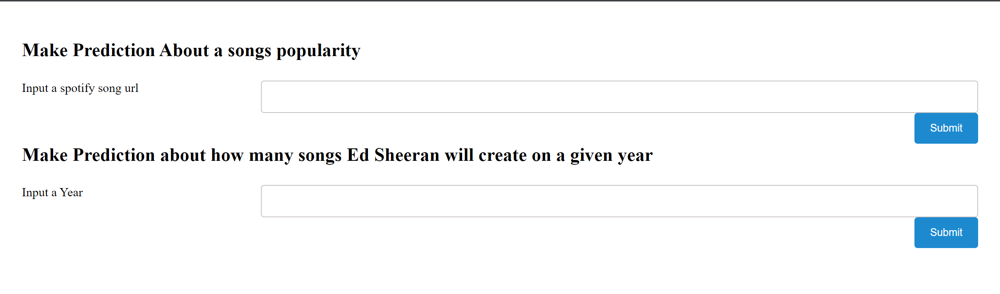
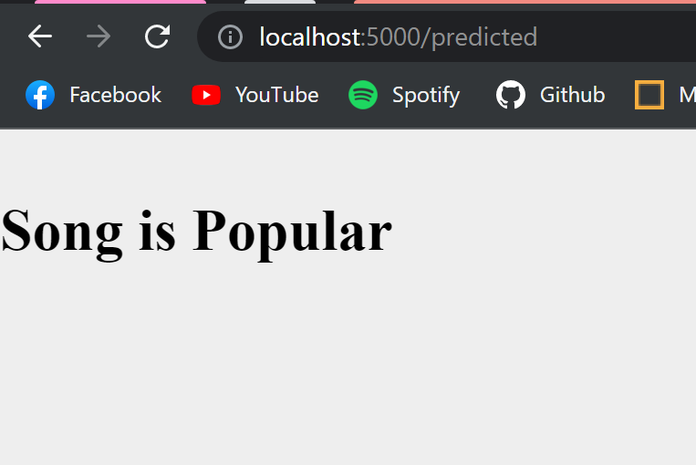
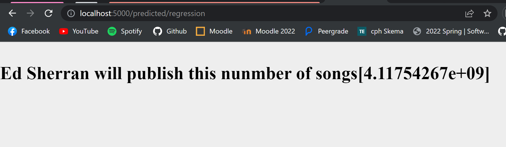
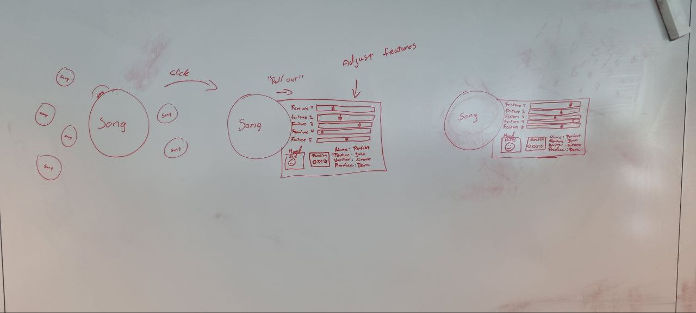
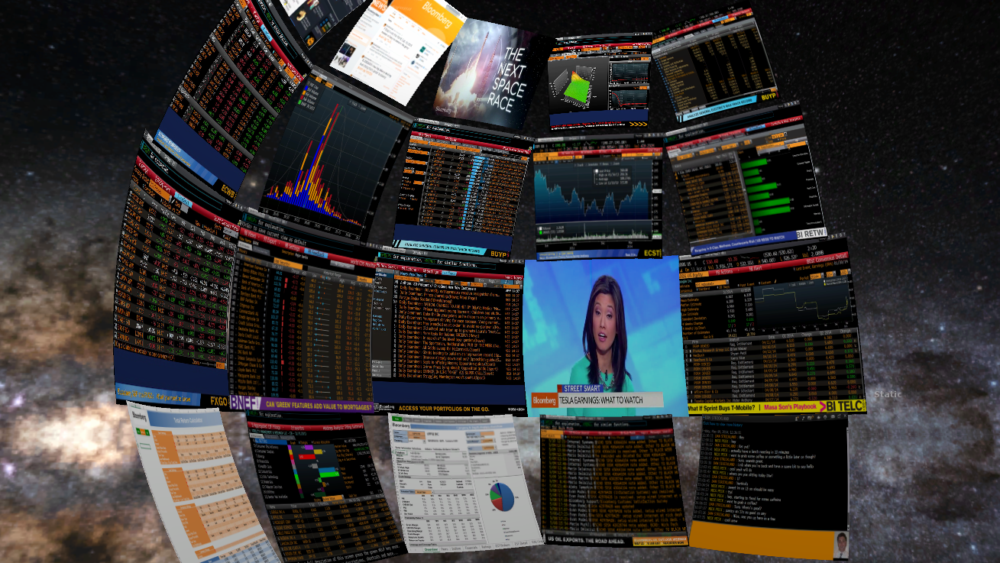

Objective: Present the process and results of the analysis in human-understandable form.

1. Create a simple webserver.

3. Create simple interface for accessing and using the model

3. Design alternative/complementing interface, which provides extended user experience.
   1. Consider applying animation, 3D visualisation, and VR/AR/MR (extended reality) techniques at least at a conceptual level
   2. If impossible to implement, draw your ideas on paper or digital surface and add the image to your project assets.
   3. Elaborate on the benefits of applying the above-mentioned visualisation techniques for data analytics.

1 & 2. Extend your solution with a design of advanced visualisation of business data scenarios and results.

### Extend your solution with a design of advanced visualisation of business data scenarios and results.

We've decided to deploy our models on a localhost flask server. 
\The server provides 3 endpoints:

**"/predict"**

/predict provides an interface for accessing a form page where you use the models.\
The site uses to models "popularity_prediction_model.pkl" & "regressionPredictor.pkl".

**popularity_prediction_model.pkl** proides a service that predicts whether is popular on un popular

**regressionPredictor.pkl** makes an estimate about how many songs Ed Sheeran will provide in a given year.

**"/predicted"**

"/predicted" serves the answer from popularity_prediction_model.pkl.

**"/predicted/regression"**

"/predicted/regression" serves the answer from regressionPredictor.pkl.

***

###3 Design alternative/complementing interface, which provides extended user experience.
We are very familiar with the concepts of graphs and charts, when visualizing data. This is because we tend to understand
data in forms better than when just looking at numbers on a piece of paper.\
####i : Consider applying animation, 3D visualisation, and VR/AR/MR (extended reality) techniques at least at a conceptual level
Modern datasets are multivariate, and can be hard to understand sometimes. But if we could implement our
 

####ii : If impossible to implement, draw your ideas on paper or digital surface and add the image to your project assets
We have tried to formulate an idea on how an alternative implementation on data analyse could be done, this is why we are trying to write
and show our idea of how this could be done in the future.

As we can see in the image above, we imagine that in a virtual reality space, a user would be able to walk amongst song nodes.
The user would also be able to see the correlation between a song and its artist, writers, producers and Label.
When a user picks a song they can grab it and place it anywhere in the "room", and when the user clicks on it, all the features belonging to this song, is displayed
next to the node via a "roll-out" section. Here the user can see the various information on the song and at what level they are.
In the ideal program, the user in virtual reality would be able to adjust these features by "twerking" the information and 
turning up and down on the features, to see how this would impact the song. 
If this was a slow and sad song, the user would hypothetically be able to knot up the "Energy" and "Dancability" to see if this could
potentially change the song from a sad song to a happy song.
this is also a way to see if this could change the place on a potential hit chart, if the trent for the given time is more into 
happy songs rather than sad songs.

####iii : Elaborate on the benefits of applying the above-mentioned visualisation techniques for data analytics.
Imagine having a 360 degree sphere of space to show your data. Without having to jump between windows to see the\ 
different parts of the dataset. 
Bloomberg made a proof of concept as shown below:
\
(https://towardsdatascience.com/5-reasons-to-use-virtual-reality-for-data-visualisation-86cd37d5c1ee) 

By showing data in this way, it could be easier to keep the grand overview of what is happening at multiple places at\
a time.
The idea of showing data like mentioned above isn't the only benefit of merging the concepts of VR and data science.
Stepping into the realm of virtual reality with data science also opens up a whole new area of possibilities for operating
on data. Take for instance our project where we are trying to analyse and work on data regarding music and the artists behind.
Here we are collecting all kinds of data on every single track in our effort to find a connection between the song and the
mood in the song, if the given song would be able to reach the hit list on spotify and so on. Imagine if one could
-in virtual reality- look at a song, grab it and from this node extract all the audio features.
Then when looking at the features, imagine twerking the "Danceability" or the "Energy" of the song, and experience live
how this will impact the data and placement of the data in the virtual space.

Using VR with data science gives new opportunities to how we perceive and experience data, and herby also how we learn\ 
from the data we are exploring.

